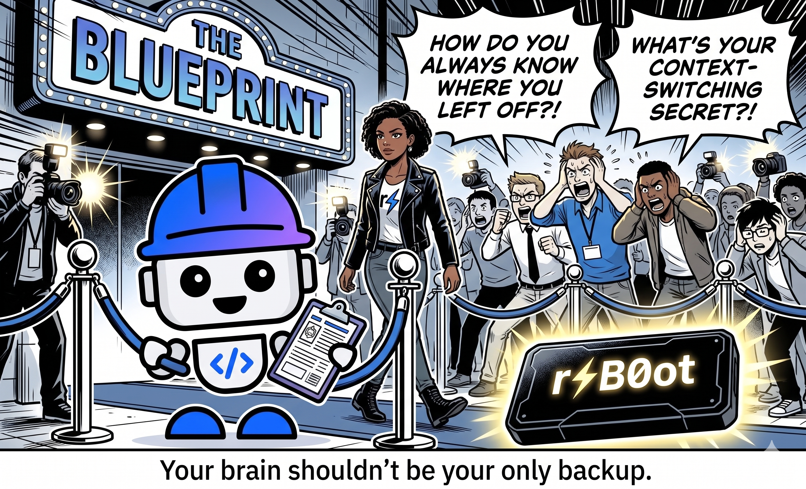
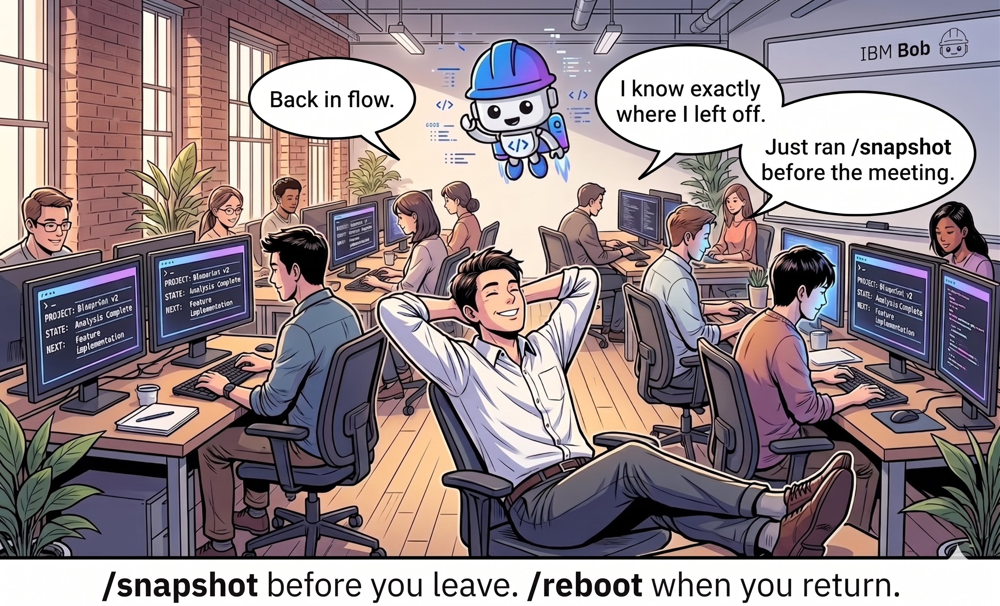
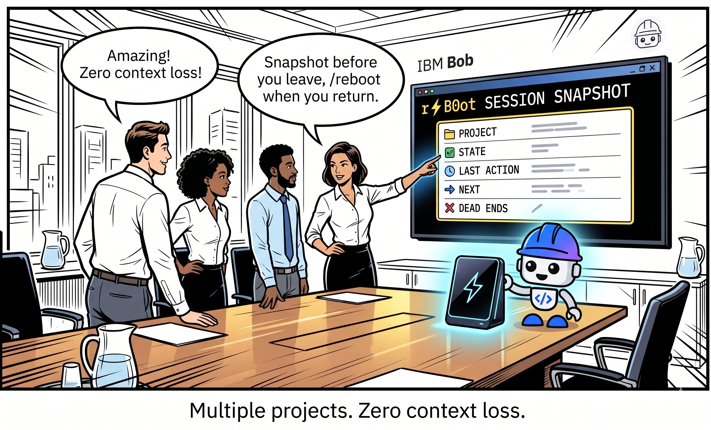
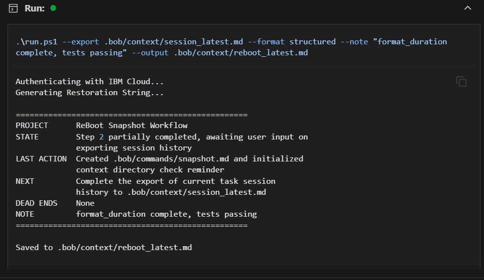
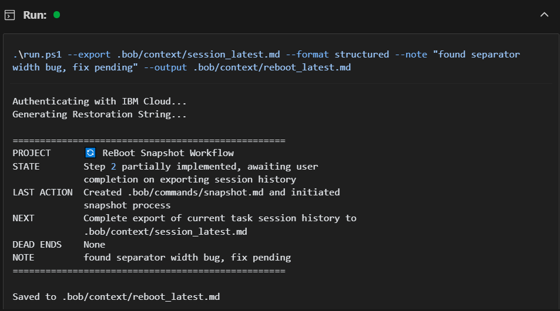
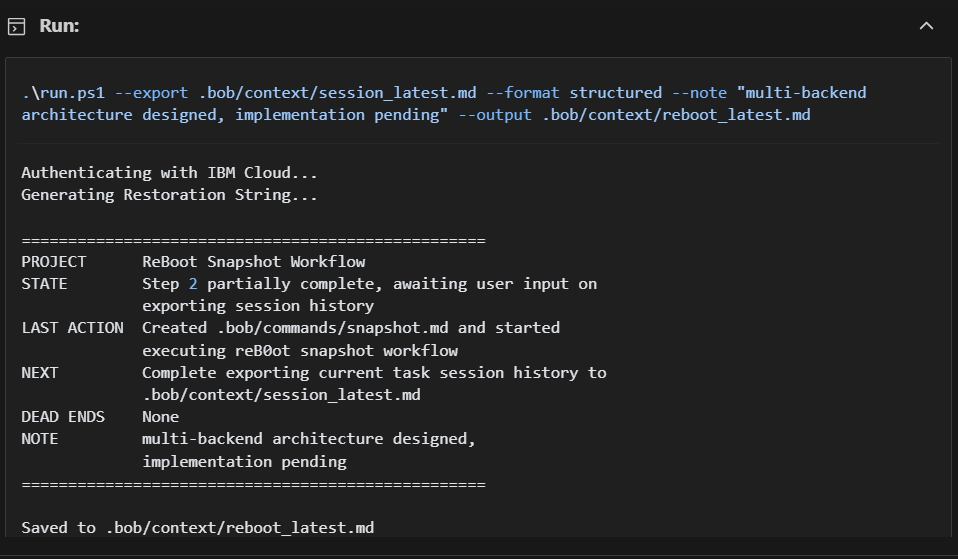
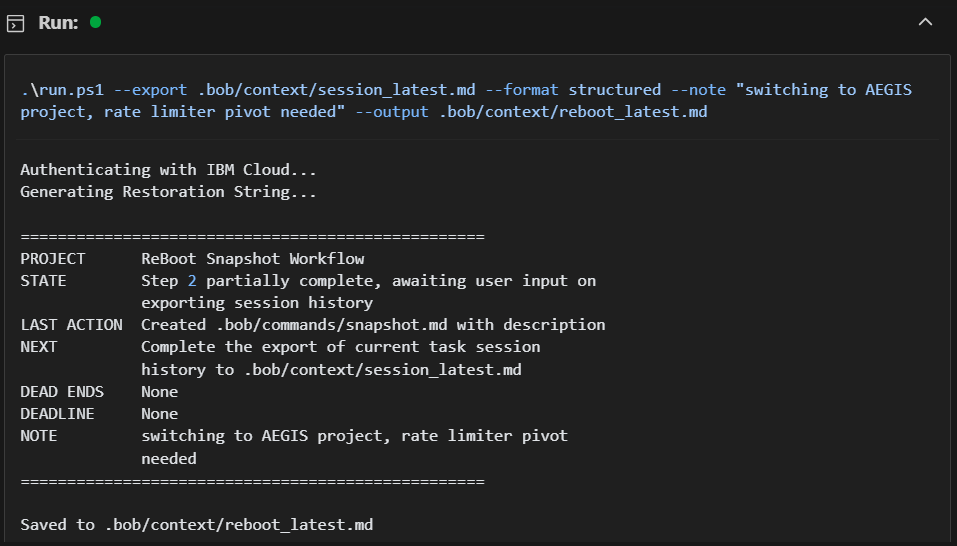
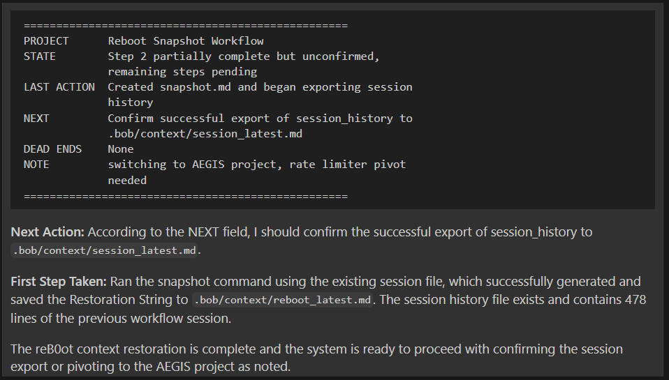

# r⚡B0ot

**THE BLUEPRINT. FLOW STATE ONLY.**

Every developer knows the feeling: you open your IDE after a break and spend
the first 20 minutes just figuring out where you left off. **r⚡B0ot** fixes that.

> *"/snapshot before you leave. /reboot when you return."*

---

## What it does

**r⚡B0ot** reads an IBM Bob IDE session export and generates a **Restoration String** — a compressed snapshot of exactly where you were, what you were doing, what you already tried, and what to do next.

Two Bob commands. Zero context loss.

```
/snapshot    →   captures your session state before you leave
/reboot      →   restores that state the moment you return
```

Bob reads the Restoration String and picks up exactly where you left off — including dead ends you already ruled out, so you never retrace wasted steps.

---

## Demo





---

## Bob Commands

The fastest path — no CLI required:

**Capture your session:**
```
/snapshot --note "your current thought or intent"
```
Runs `reboot.py` against the current session export, saves the Restoration String to `.bob/context/reboot_latest.md`.

**Restore your session:**
```
/reboot
```
Reads `.bob/context/reboot_latest.md` and restores full session context — project state, last action, next step, dead ends.

---

## CLI Usage

**Requirements:**
- Python 3.11+
- IBM Cloud account with watsonx.ai access

**Setup:**
```bash
python -m venv venv
venv\Scripts\activate     # Windows
source venv/bin/activate  # Mac/Linux
pip install -r requirements.txt
```

**Credentials:**
```powershell
# Copy the template and add your credentials
copy run.ps1.template run.ps1
# Edit run.ps1 with your actual API key and project ID
```

**Run:**
```powershell
# Structured output (recommended)
.\run.ps1 --export your_session_export.md --format structured

# Paragraph output
.\run.ps1 --export your_session_export.md --format paragraph

# Add a personal note to the card
.\run.ps1 --export your_session_export.md --format structured --note "picking this up after sprint review"

# Interactive mode — choose from multiple NEXT options
.\run.ps1 --export your_session_export.md --format structured --interactive

# Save output directly to file (UTF-8)
.\run.ps1 --export your_session_export.md --format structured --output .bob/context/reboot_latest.md
```

**Structured output:**
```
==================================================
PROJECT      reB0ot v2
STATE        Core features complete, testing done
LAST ACTION  Added smart truncation and credential scanner
NEXT         Commit and push to reB0ot repo
DEAD ENDS    None
NOTE         ready for submission
==================================================
```

---

## How to export a Bob session

1. In Bob IDE: **Views → More Actions → History**
2. Select a task → click the **Export** icon
3. Save the `.md` file
4. Run `reboot.py` against it — or use `/snapshot` to do it automatically

---

## Showcase

Real sessions from this project's own development:







---

## Security

**r⚡B0ot** scans every session export for potential credentials before sending anything to the API. If a real API key, password, or secret is detected, processing stops immediately. Placeholder values and code patterns are recognized and skipped automatically.

---

## How it was built

Built entirely using **IBM Bob IDE** across two hackathons. Every session was exported and fed back through r⚡B0ot itself — the `bob_sessions/` folder is the proof.

**v2 improvements built during IBM Bob Hackathon, May 15–17, 2026:**
- Smart three-part session truncation (head / keyword middle / tail)
- Precision credential scanner with placeholder and code-pattern detection
- `--interactive` mode for multi-option NEXT selection
- `--note` annotation flag
- `--output` flag for UTF-8 file export
- `/snapshot` and `/reboot` Bob commands
- 11-test suite with 100% pass rate

**Stack:**
- IBM Bob IDE — Code, Ask, Plan, Advanced, and Orchestrator modes
- watsonx.ai — `meta-llama/llama-3-3-70b-instruct`
- Python — CLI, API calls, card rendering

---

## The meta angle

This tool was built using itself. Every Bob session during development was exported and processed through r⚡B0ot. The `/reboot` command restored context at the start of every session. The `bob_sessions/` folder contains the complete development history — over 20 exported sessions from this project alone.

---

## Bob sessions

All exported Bob task sessions are in `bob_sessions/` — full task history markdown files from both v1 (May 2026) and v2 (May 15–17, 2026 hackathon sprint).

---

*Built with IBM Bob. Powered by watsonx.ai.*
